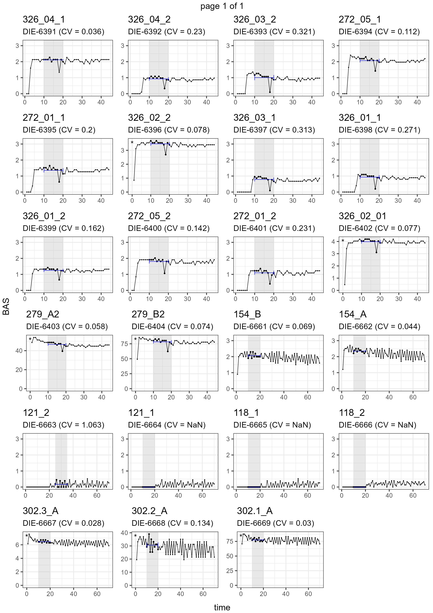

<!-- README.md is generated from README.Rmd. Please edit that file -->

```{r, include = FALSE}
knitr::opts_chunk$set(
  collapse = TRUE,
  comment = "#>",
  fig.path = "man/figures/README-",
  out.width = "100%"
)
```

# o2eie

<!-- badges: start -->
<!-- badges: end -->

The goal of o2eie is to provide an easy and consistent workflow for processing O2 data generated from the O2-microcompensation labs from EIE.

## Installation

You can install the o2eie package from GitHub by running:

``` r
remotes::install_github("gpatoine/o2eie")

```

## Example

This is a basic example which shows you how to use the package. The function `o2_process_all` will generate a tibble (similar to a data.frame) with all main measurements, including basal respiration, microbial biomass, and microbial growth in different columns. The function only requires a vector of weighing sheets.

```{r example}
library(o2eie)

weights <- list.files(system.file("extdata", package = "o2eie"),
                      pattern = "^w_.*\\.xlsx",
                      full.names = T)

o2meas <- o2_process_all(files = weights)


```


### Reports

It is recommended to review the datapoints used for basal respiration and cmic measurements for each sample. This can be done using PDF reports.

```{r reports}
o2meas %>% 
  bas_report("bas.pdf") %>% 
  cmic_report("cmic.pdf") %>% 
  mgrow_report("mgrowth.pdf")


```




### Manually adjusting calculation periods

Based on the reports, we can adjust the period considered for the calculation of basal respiration and microbial biomass. The easiest way to do this is a tibble that contains the new values. Be sure to use the columns "name_c" and "times", as shown below.

```{r adjust-times}

adjust_bas <- tribble(
  ~name_c, ~times,
  "326_04_1", c(10:17, 19:20),
  "121_2", c(25:35),

)

o2meas <- o2meas %>% 
  set_bas_times(tib = adjust_bas) %>% 
  o2_bas(only_sets = TRUE)

o2meas %>% 
  filter(name_c %in% adjust_bas$name_c) %>% 
  select(name_c, bas_set)

bas_report(o2meas, "bas2.pdf")


```

Contact: guillaume.patoine@idiv.de
