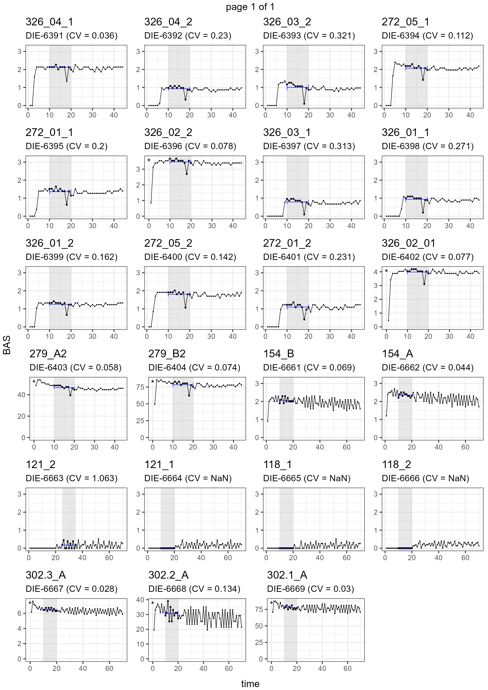

<!-- README.md is generated from README.Rmd. Please edit that file -->

# o2eie

The goal of o2eie is to provide an easy and consistent workflow for
processing O2 data generated from the O2-microcompensation devices at
the EIE labs.

## Preparation

To start you need to have all your weighing sheets formatted to make
sure that the data can be read correctly. Use the template available in
“template/w_template.xlsx” to align your entries properly. Be sure also
to include the names of the raw data files (with extension) at the
appropriate place and put all the files in the same folder.

## Installation

You can install the o2eie package from GitHub by running:

``` r
remotes::install_github("gpatoine/o2eie")
```

## Example

The easiest way to process all the files is using the function
`o2_process_all()` which is a comprehensive wrapper for reading the data
and calculating the main measurements. The function only requires a
vector of weighing sheets, and it returns a tibble (a modern data.frame)
with all raw values and derived measurements, including basal
respiration, microbial biomass, and microbial growth.

``` r
library(o2eie)
```

Normally, you can write the file paths manually, or for example use all
the Excel files from a folder using `list.files()`.

``` r

weights <- list.files("myfolder", pattern = "\\.xlsx", full.names = T)
```

In this case, we are using the example dataset from the package, with
two weighing sheets. We use regular expressions to find the weighing
sheets that start with a “w” and end with “.xlsx”.

``` r

weights <- list.files(system.file("extdata", package = "o2eie"),
                      pattern = "^w_.*\\.xlsx",
                      full.names = T)

weights
#> [1] "C:/Users/gp63dyte/R/win-library/4.2/o2eie/extdata/w_DIETER_6391-6420_2019-11-26_Project1.xlsx"
#> [2] "C:/Users/gp63dyte/R/win-library/4.2/o2eie/extdata/w_DIETER_6661-6690_2020-02-10_Project1.xlsx"

o2meas <- o2_process_all(files = weights)
#> Processing w_DIETER_6391-6420_2019-11-26_Project1.xlsx
#> Processing w_DIETER_6661-6690_2020-02-10_Project1.xlsx
```

### Reports

To review the datapoints used for individual measurements, it is
possible to generate PDF reports with time series of incubation.

``` r
o2meas %>% 
  bas_report("bas.pdf") %>% 
  cmic_report("cmic.pdf") %>% 
  mgrow_report("mgrowth.pdf")
```

For example, the PDF report for basal respiration looks like this:



### Manually adjusting calculation periods

It is often necessary to check the datapoints used for basal respiration
and cmic measurements individually using the reports. In cases where the
chosen timepoints are not satisfactory, we can adjust the period
considered for the calculation of basal respiration and microbial
biomass. The easiest way to do this is by creating a tibble with the
function `tribble()` that contains the new values, with column names
“name_c” and “times”, as shown below, and use `set_bas_times()` or
`set_cmic_times()` provided in the package.

`o2_bas()` is used to recalculate the basal respiration and
automatically uses the column “bas_set” (created by `set_bas_times()`)
if it is available.

``` r
library(dplyr)
#> Warning: package 'dplyr' was built under R version 4.2.3
#> 
#> Attaching package: 'dplyr'
#> The following objects are masked from 'package:stats':
#> 
#>     filter, lag
#> The following objects are masked from 'package:base':
#> 
#>     intersect, setdiff, setequal, union

adjust_bas <- tribble(
  ~name_c, ~times,
  "326_04_1", c(10:17, 19:20),
  "121_2", c(25:35)
)

o2meas <- o2meas %>% 
  set_bas_times(tib = adjust_bas) %>% 
  o2_bas(only_sets = TRUE)

# View the changes
o2meas %>% 
  filter(name_c %in% adjust_bas$name_c) %>% 
  select(name_c, bas_set)
#> # A tibble: 2 × 2
#>   name_c   bas_set   
#>   <chr>    <list>    
#> 1 326_04_1 <int [10]>
#> 2 121_2    <int [11]>
```

The report can then be generated again with the changes implemented.

``` r
bas_report(o2meas, "bas_updated.pdf")
```

## Vignette

You can read the vignette with a slightly extended example: [o2eie
vignette](https://htmlpreview.github.io/?https://raw.githubusercontent.com/gpatoine/o2eie/main/o2eie_vignette.html)

Do not hesitate to contact me if you run into issues with the package or
would like to adapt it to your use case.

Contact: <guillaume.patoine@idiv.de>
