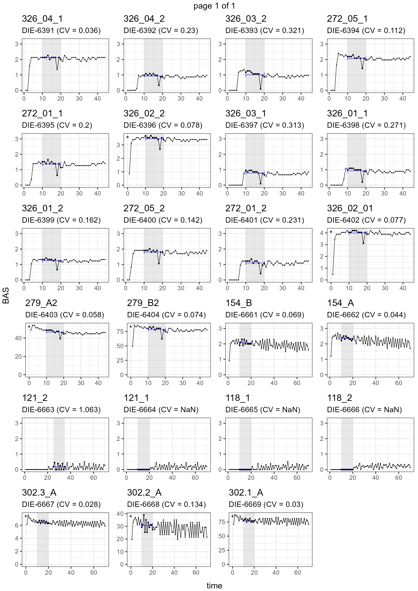

```{r, include = FALSE}
knitr::opts_chunk$set(
  collapse = TRUE,
  comment = "#>"
)
```


# o2eie

The goal of o2eie is to provide an easy and consistent workflow for processing O2 data generated from the O2-microcompensation devices at the EIE labs.


## Preparation

To start you need to have all your weighing sheets formatted to make sure that the data can be read correctly. Use the template available in "template/w_template.xlsx" to align your entries properly. Be sure also to include the names of the raw data files (with extension) at the appropriate place and put all the files in the same folder.


## Installation

You can install the o2eie package from GitHub by running:

``` r
remotes::install_github("gpatoine/o2eie")

```

## Example

The easiest way to process all the files is using the function `o2_process_all()` which is a comprehensive wrapper for reading the data and calculating the main measurements. The function only requires a vector of weighing sheets, and it returns a tibble (a modern data.frame) with all raw values and derived measurements, including basal respiration, microbial biomass, and microbial growth.

```{r example}
library(o2eie)

# using the example dataset from the package, with two weighing sheets
weights <- list.files(system.file("extdata", package = "o2eie"),
                      pattern = "^w_.*\\.xlsx",
                      full.names = T)

weights

o2meas <- o2_process_all(files = weights)


```


### Reports

To review the datapoints used for individual measurements, it is possible to generate PDF reports with time series of incubation.

``` r
o2meas %>% 
  bas_report("bas.pdf") %>% 
  cmic_report("cmic.pdf") %>% 
  mgrow_report("mgrowth.pdf")

```

For example, the PDF report for basal respiration looks like this:

```{r echo=FALSE, out.width='90%'}


```


### Manually adjusting calculation periods

It is often necessary to check the datapoints used for basal respiration and cmic measurements individually using the reports. In cases where the chosen timepoints are not satisfactory, we can adjust the period considered for the calculation of basal respiration and microbial biomass. The easiest way to do this is by creating a tibble with the function `tribble()` that contains the new values, with column names "name_c" and "times", as shown below, and use `set_bas_times()` or `set_cmic_times()` provided in the package.

`o2_bas()` is used to recalculate the basal respiration and automatically uses the column "bas_set" (created by `set_bas_times()`) if it is available.

```{r adjust-times}
library(dplyr)
library(purrr)

adjust_bas <- tribble(
  ~name_c, ~times,
  "326_04_1", c(10:17, 19:20),
  "121_2", c(25:35),

)

o2meas <- o2meas %>% 
  set_bas_times(tib = adjust_bas) %>% 
  o2_bas(only_sets = TRUE)

# View the changes
o2meas %>% 
  filter(name_c %in% adjust_bas$name_c) %>% 
  select(name_c, bas_set)
```

The report can then be generated again with the changes implemented.


``` r
bas_report(o2meas, "bas_updated.pdf")

```

## Examples of additional checks

Additional checks might be necessary to assure that the data is adequate.

```{r checks}
# no weights
any(is.na(o2meas$wei_samp_dry))


# pulse test
o2meas %>% count(pulse_cmic_test)
o2meas %>% count(pulse_cmic_max) %>% arrange(desc(pulse_cmic_max))


# no BAS value
o2meas %>% filter(is.na(basal))


# no cmic value
o2meas %>% filter(is.na(cmic)) #%>% View

# qO2: OK
o2meas %>% filter(is.na(qo2)) #%>% View


# negative water content
o2meas %>% pull(h2o_perc) %>% range
o2meas %>% pull(h2o_perc) %>% hist
o2meas %>% filter(h2o_perc < 0) #%>% View
o2meas <- o2meas %>% mutate(h2o_perc = if_else(h2o_perc < 0, 0, h2o_perc))

```


```{r no-raw}
# no raw data values
all_na <- function(raw) {
  all(is.na(raw))
  
}

o2meas <- o2meas %>% mutate(bas_allNA = map_lgl(bas_raw, all_na),
                            cmic_allNA = map_lgl(cmic_raw, all_na))

o2meas %>% count(bas_allNA)
o2meas %>% count(cmic_allNA)


```


Do not hesitate to contact me if you run into issues with the package or would like to adapt it to your use case.


Contact: guillaume.patoine@idiv.de